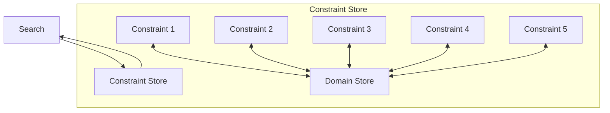

## Constraint Programming
### tldr;
- how to use constraints to prune the search space
- focus is on feasibility (constraint satisfaction)
- complete method, no heuristic, can always find a solution (given enough time)

### constraint programming engine
- the propagation engine : picks a constraint, cheks for feasibility, if yes then prunes (see above) and keeps doing that in an iterative manner. if/when stuck, goes back to the search module
 

### how it works
- each of the constraints has two tasks : checks for feasibility and prunes the search space - in isolation from the rest of the constraints
- feasibility checking example, assuming x≠y; i need to ensure that the size of the union of the two domains is greater than one, i.e. i can take at least two values and therefore x≠y is
- pruning example, assuming x≠y; say x ∈ {1} and y ∈ {1, 2, 3}, then we can remove 1 from the domain of y because x≠y.

### examples
#### N-Queens
- associate a decision variable with each column
- the variable denotes the row where the queen will be placed in that particular column
- constraints: now queens on the same row, upward or downward diagonals
- when i place a queen in column 1, at row one, the constraint propagation begins...

#### Graph-Coloring
- start by making a decision for a variable (Belgium is black)
- propagate the constraints/decision and prune the domain/search space for the (then France, Luxembourg, Netherlands, Germany cannot be black)

#### Send More Money
- ...

