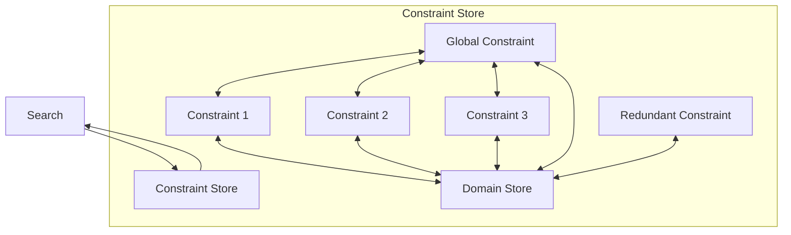

## Constraint Programming
### tldr;
- how to use constraints to prune the search space
- focus is on feasibility (constraint satisfaction)
- complete method, no heuristic, can always find a solution (given enough time)

### constraint programming engine
- the propagation engine : picks a constraint, cheks for feasibility
- if yes then prunes (see above) and keeps doing that in an iterative manner. if/when stuck, goes back to the search module

 

### how does it work
- each of the **constraints has two tasks** : checks for *feasibility* and *prunes* the search space - in isolation from the rest of the constraints
- feasibility checking example, assuming x≠y; i need to ensure that the size of the union of the two domains is greater than one, i.e. i can take at least two values and therefore x≠y is
- pruning example, assuming x≠y; say x ∈ {1} and y ∈ {1, 2, 3}, then we can remove 1 from the domain of y because x≠y.

### constrained programming optimization
- solves a sequence of feasibility problems
- find a solution and then impose a constraint that the next solution must be better than the current

### constraint programming specifics
- constraint programming solvers typically introduce a very expressive syntax.
- **reification** : a reified constraint can be represented as a binary variable, where the variable is set to 1 if the constraint is satisfied (true) and 0 if it is not (false).
- **element constraint** : ability to index an array/matrix with a variable or an expression of variables; can help in propagating information between variables, as changes in one variable can affect the possible values of the others.
- **logical combinations** : of constraints involve using logical operators (like AND, OR, NOT) to combine multiple constraints into a single expression.
- **global constraints** (e.g. `alldifferent`, `knapsack`) : they enable early detection of *infeasibility* in the search space and also facilitate *pruning* of the search space by eliminating impossible values from variable domains
- **table constraints** : are another simple yet powerful global constraint that specifies legal combinations of variable assignments, enhancing the ability to deduce values based on existing information
- **symmetry breaking**, variable symmetries and value symmetries
- impose lexicographical ordering to break symmetries between variables
- lexicographical constraints can be applied by ensuring that each row is ordered in a specific way (e.g., the first row must be lexicographically smaller than the second row). This helps avoid symmetrical solutions.
- for example, if tasks are assigned to time slots, you can impose that the first task scheduled must be lexicographically smaller than the second task.
- **redundant constraints** : semantically redundant, do not exclude any information *but* are computationally significant since they reduce the search space
- express properties of the solution and boost the propagation of other constraints
- provide a more global view and improve 'communication' by combining existring constraints

### examples
#### N-Queens
- associate a decision variable with each column
- the variable denotes the row where the queen will be placed in that particular column
- constraints: now queens on the same row, upward or downward diagonals
- when i place a queen in column 1, at row one, the constraint propagation begins...

#### Graph-Coloring
- start by making a decision for a variable (Belgium is black)
- propagate the constraints/decision and prune the domain/search space for the (then France, Luxembourg, Netherlands, Germany cannot be black)

#### More examples
- Send More Money -> course 2
- Stable marriages -> course 3
- Sudoku -> course 4
- Scene Allocation -> course 5
- Car Sequencing -> course 7