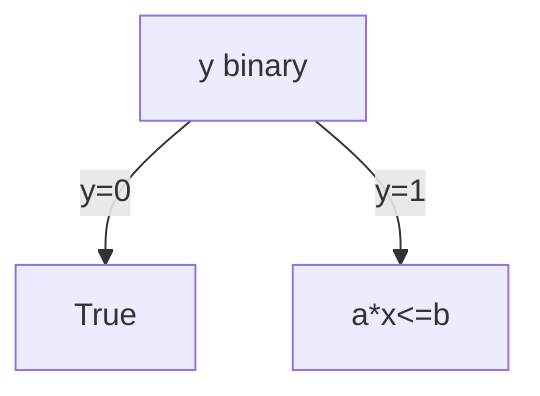

# Special Types of Constraints

## Summary
- if-then / implication / conditional constraints
- logical operations
- big-M notation to activate/deactivate constraints
- fixed charge constraints
- [further reading](https://textbooks.open.tudelft.nl/textbooks/catalog/view/94/212/471)

 

---

 

## Implications

### Summary

- `y ⇒ x` · `if y then x` → $y \le x$
- `y ⇒ ¬ x` · `if y then not x`→ $y \le 1 - x$
- `¬ y ⇒ x` · `if not y then x`→ $1- y \le x$
- `¬ y ⇒ ¬ x` · `if not y then not x` → $x \le y$

### Process

- Rule : **y ⇒ x**
    - Logical form: $ \neg y \vee x $ · `If 𝑦 is false or 𝑥 is true, the statement holds`
    - Rewrite: $ (1 - y) + x \geq 1 $ · `The ≥ part suggests the statement holds`
    - Simplify: $ y \leq x $

- Rule : **y ⇒ ¬ x**
    - Logical form: $ \neg y \vee \neg x $
    - Rewrite: $ (1 - y) + (1 - x) \geq 1 $
    - Simplify: $ y \leq 1 - x $

- Rule : **¬ y ⇒ x**
    - Logical form: $ y \vee x $
    - Rewrite: $ y + x \geq 1 $
    - Rearrange: $ 1 - y \leq x $

- Rule: **¬ y ⇒ ¬ x**
    - Logical form: $ y \vee \neg x $
    - Rewrite: $ y + (1 - x) \geq 1 $
    - Simplify: $ x \leq y $

### Clarifications
The rule $ y \implies x $ only specifies behavior **when $ y = 1 $**:
- If $ y = 1 $: $ x $ must be $ 1 $ (to satisfy the implication).
- If $ y = 0 $: The rule **does not impose any requirement** on $ x $, so $ x $ can be either $ 0 $ or $ 1 $. This is because the implication $ y \implies x $ is always true when $ y = 0 $ (this is a quirk of logical implication).
- Thus, if $ y $ is false, $ x $'s value doesn’t matter because the 
#### Intuition:
- Think of $ y \implies x $ as a **promise**:
- If $ y $ happens, then $ x $ must also happen.
- If $ y $ doesn’t happen, you don’t break the promise, no matter what $ x $ does.
- Further reading: [link1](https://youtu.be/tDH67yRNXzI?si=AwmvrPULSSh1HS9d&t=394), [link2](https://youtu.be/F3544ZyO-eU?si=hYJV_dwaaH_WQ-G0&t=247), [link3](https://www.youtube.com/watch?v=6kYngPvoGxU&t=1s), [link4](https://youtu.be/tYXHlEBlJMo?si=R4-qf5cSr9_t6mFE&t=280)

 

---

 

## Logical Operations

- **AND ($ z = x \wedge y $)**:
    - $ z $ is the **minimum** of $ x $ and $ y $.  
    - Derived by enforcing $ z \leq x $, $ z \leq y $, and $ z \geq x + y - 1 $.

- **OR ($ z = x \vee y $)**:
    - $ z $ is the **maximum** of $ x $ and $ y $.  
    - Derived by enforcing $ z \geq x $, $ z \geq y $, and $ z \leq x + y $.

 

---

 

## Big-M notation

- used to turn constraints on and off
- $ ax \le b + M (1-y)$
 

 

---

 

## Fixed Charge

- Fixed charge constraints model scenarios where a fixed cost or resource is incurred only when a certain activity takes place. 

---

### **Mathematical Representation**

1. **Fixed Cost Activation**:
   - If an activity is chosen ($ x = 1 $), a fixed cost $ F $ is incurred.
   - If not ($ x = 0 $), no cost is incurred.

   **Formulation**:
   $
   \text{Total Cost} \geq F \cdot x
   $

---

2. **Capacity/Usage Constraints**:
   - If a facility is open ($ z = 1 $), its capacity $ C $ applies to any flow $ f $.
   - If not ($ z = 0 $), no flow is allowed.

   **Formulation**:
   $
   0 \leq f \leq C \cdot z
   $

---

### **Practical Examples**

#### **1. Facility Opening Cost**
**Scenario**: If a warehouse is opened ($ x = 1 $), it incurs a fixed cost of $10,000.

**Formulation**:
$
\text{Total Cost} \geq 10,000 \cdot x
$

---

#### **2. Machine Capacity**
**Scenario**: A machine can only produce units if it is activated ($ z = 1 $) and has a maximum capacity of 200 units.

**Formulation**:
$
0 \leq \text{Production} \leq 200 \cdot z
$